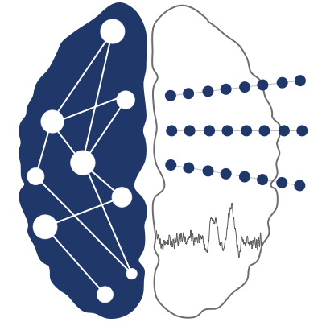

<h1 align="center">Human Intracranial Cognitive Neurophysiology</h1>

<i>From single units to large-scale networks</i>

 

<table>
<tr>
<td width="35%" align="center">

</td>

<td width="65%">

Welcome to the **Helfrich Lab GitHub organization**. Here we host the repositories associated with our research projects, with the goal of improving **transparency, reproducibility, and accessibility** of our work.

The goal of the **Helfrich Lab** is to unravel the neural network mechanisms supporting higher cognitive functions and their disturbances underlying neuropsychiatric disorders. We study the functional architecture of human cognition with a spatiotemporal resolution spanning **single units to large-scale network activity**.

In particular, we seek to understand **context-dependent, goal-directed behavior in humans** through the study of neural network dynamics with a particular emphasis on **prefrontal cortex (PFC) physiology**.

Our central hypothesis is that **context-dependent endogenous brain activity shapes cognitive processing across cortical states**, such as wakefulness and sleep. A core research focus is the systematic investigation of the **functional network architecture of cortico-cortical and subcortico-cortical interactions** supporting cognitive processes including **attention and memory**, and their impairment in **healthy aging and neurodegenerative diseases**.

</td>
</tr>
</table>